# Commit Changes — Fluxo de Execução

Diagrama Mermaid com todas as decisões e ações do agente ao executar a skill `commit-changes`.

```mermaid
flowchart TD
    Start([Usuário faz request de commit]) --> CheckSkill{Skill aplicável?}

    CheckSkill -->|não: git log, rebase, squash, cherry-pick, revert, merge-conflict sem commit, DB transaction, pergunta educacional| StopSkill[Não carregar skill]

    CheckSkill -->|sim| Parse[1. Parse Intent & Scope]

    Parse --> ParseA{Explicitamente pediu commit?}
    ParseA -->|não| StopNoCommit[Parar: não é request de commit]
    ParseA -->|sim| ParseB{Nomeou paths?}

    ParseB -->|sim| ScopePath[Escopo = paths nomeados]
    ParseB -->|não| ParseC{Optou por worktree inteira?<br/>all, --all, tudo, worktree inteira}
    ParseC -->|sim| ScopeAll[Escopo = todos arquivos modificados]
    ParseC -->|não, mas conversa aponta execução| ScopeConv[Escopo = arquivos da execução recente]
    ParseC -->|não, sem contexto claro| ScopeAmbig[Escopo ambíguo]

    ScopePath --> CheckPathExists{Path existe e tem mudanças?}
    CheckPathExists -->|não| StopNoChanges[Parar: No changes found]
    CheckPathExists -->|sim| Inspect
    ScopeAll --> Inspect
    ScopeConv --> Inspect
    ScopeAmbig --> PauseAmbig1[Pausar e explicar ambiguidade]

    Inspect[2. Inspect Working Tree<br/>git status --short<br/>git diff --stat HEAD<br/>git diff HEAD -- scope] --> CheckState{Estado do repo ok?}

    CheckState -->|merge conflict / rebase / cherry-pick / merge em andamento| StopConflict[Parar e escalar]
    CheckState -->|sem mudanças no escopo| StopEmpty[Parar: nada a commitar]
    CheckState -->|ok| Delegate{Subagent disponível?<br/>e plataforma permite?}

    Delegate -->|sim| Subagent[Delegar análise a subagent<br/>model mais barato, reasoning low<br/>inspect tree, propor grupos, draft messages, identificar AGENTS updates]
    Delegate -->|não| Inline[Continuar inline]
    Subagent --> Groups
    Inline --> Groups

    Groups[3. Decide Commit Groups<br/>agrupar por concern lógico] --> SplitDecision{Conseguir separar por<br/>file boundaries?}

    SplitDecision -->|sim, separado por arquivos| Multi{Mais de um grupo?}
    SplitDecision -->|não, misturado no mesmo arquivo| MixedFile{Oferecer git add -p<br/>como opção ao usuário?}

    MixedFile -->|sim, usuário pode dirigir| PauseAddP[Pausar e sugerir git add -p]
    MixedFile -->|não, decisão semântica necessária| PauseSemantic[Pausar: split inseguro]

    Multi -->|sim| MultiCommit[Plano multi-commit]
    Multi -->|não| SingleCommit[Plano single-commit]

    SingleCommit --> Message
    MultiCommit --> Message

    Message[4. Build Commit Message<br/>Conventional Commits<br/>type scope: subject] --> TypeCheck{Escolher menor type honesto}
    TypeCheck --> MessageReady[Mensagem pronta]

    MessageReady --> Agents[5. Check AGENTS.md Impact]
    Agents --> AgentsCheck{Diff muda como agentes<br/>devem trabalhar?}
    AgentsCheck -->|sim, e user não pediu skip| AgentsUpdate[Atualizar AGENTS.md mais próximo<br/>ler, atualizar seção, preservar markers,<br/>atualizar timestamp, stagear junto]
    AgentsCheck -->|não| AgentsNone[Anotar: nenhum update AGENTS necessário]
    AgentsCheck -->|user pediu skip AGENTS| AgentsSkip[Pular AGENTS update]

    AgentsUpdate --> Plan
    AgentsNone --> Plan
    AgentsSkip --> Plan

    Plan[6. Present Execution Plan<br/>mostrar plano conciso] --> RiskCheck{Há risco real ou ambiguidade?}

    RiskCheck -->|sim: agrupamento ambíguo, conflito com staged, split precisa git add -p, fix muda behavior| PauseRisk[Pausar e perguntar]
    RiskCheck -->|não| Execute[7. Execute the Plan]

    Execute --> Loop{Próximo commit?}
    Loop -->|sim| StageCommit[Stagear apenas arquivos do commit<br/>incluir AGENTS updates se pertencem<br/>git add files]
    StageCommit --> DoCommit[git commit -m message<br/>-m body se necessário]
    DoCommit --> Verify[Verificar commit<br/>git show --stat --oneline HEAD]
    Verify --> Refresh[Refresh git status --short]
    Refresh --> Loop

    Loop -->|não, todos feitos| Done([Fim: commits criados])

    DoCommit --> HookFail{Hook falhou?}
    HookFail -->|não| Verify
    HookFail -->|sim| HookRead[Ler erro]
    HookRead --> HookType{Falha determinística?}
    HookType -->|sim: formatting, import order, unused imports, type annotations| HookFix[Auto-fix direto]
    HookFix --> HookRetry[Re-rodar verificação mínima]
    HookRetry --> DoCommit
    HookType -->|decisão de produto, API contract, refactor não óbvio| HookPause[Pausar e perguntar]
    HookType -->|user pediu --no-verify| NoVerifyCheck[Confirmar com user implicações]
    NoVerifyCheck -->|confirmado| DoCommitNoVerify[git commit --no-verify]
    NoVerifyCheck -->|não confirmado| HookFix

    DoCommit --> IdentityFail{user.name/user.email<br/>não configurado?}
    IdentityFail -->|sim| StopIdentity[Parar, não inventar identidade<br/>sugerir git config local<br/>pedir valores ao user]
    IdentityFail -->|não| Verify

    style Start fill:#90EE90
    style Done fill:#90EE90
    style StopSkill fill:#8B0000
    style StopNoCommit fill:#8B0000
    style StopNoChanges fill:#8B0000
    style StopConflict fill:#8B0000
    style StopEmpty fill:#8B0000
    style StopIdentity fill:#8B0000
    style PauseAmbig1 fill:#FFD700
    style PauseAddP fill:#FFD700
    style PauseSemantic fill:#FFD700
    style PauseRisk fill:#FFD700
    style HookPause fill:#FFD700
    style DoCommitNoVerify fill:#FFA07A
```

## Legenda

| Cor | Significado |
| --- | --- |
| 🟢 Verde | Início / Fim |
| 🔴 Rosa | Parada (não executar) |
| 🟡 Amarelo | Pausa para o usuário |
| 🟠 Salmão | Caminho `--no-verify` (exceção controlada) |

## Etapas do Fluxo

1. **Filtro de ativação** — decide se a skill se aplica (exclui `git log`, rebase, squash, cherry-pick, revert, merge-conflict sem commit, transações de DB, perguntas educacionais).
2. **Parse de intenção e escopo** — 4 caminhos: paths nomeados, worktree inteira, escopo por conversa, escopo ambíguo.
3. **Inspeção do working tree** — 3 condições de parada (conflito/rebase em andamento, escopo sem mudanças, path inexistente).
4. **Delegação para subagent** vs continuação inline.
5. **Decisão de grupos** — split por arquivo vs arquivo misturado (oferecer `git add -p` ou pausar).
6. **Construção da mensagem** — Conventional Commits, menor type honesto.
7. **Verificação de AGENTS.md** — 3 caminhos: atualizar, nenhum, skip.
8. **Plano e checagem de risco** — pausar se houver risco real.
9. **Loop de execução sequencial** — stage → commit → verify → refresh.
10. **Tratamento de hook failures** — auto-fix determinístico, pausar para decisões de produto, `--no-verify` apenas com confirmação.
11. **Contingência de identidade git ausente** — parar e pedir valores ao usuário.