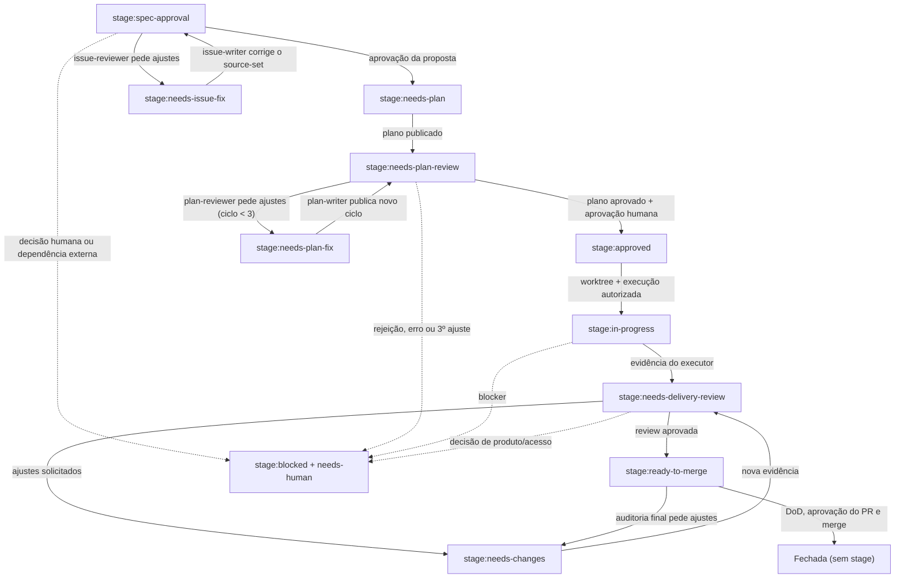

# code-flow

Coordena entregas não triviais via papéis independentes, issues GitHub, gates
de aprovação e evidência de PR.

Comandos, fases e regras canônicas: [SKILL.md](SKILL.md).

Contratos: [references/github-flow.md](references/github-flow.md),
[templates/evidence-contract-template.md](templates/evidence-contract-template.md),
[references/orchestrator-cheatsheet.md](references/orchestrator-cheatsheet.md).

## Estados da issue

`needs-human` é uma label ortogonal: aparece nos gates de aprovação e em
`stage:blocked`, mas não substitui o `stage:*` atual.

## Quando usar code-flow vs super-planning

- **code-flow:** entrega governada com ADR/spec, stages GitHub, gates humanos e
  evidência de PR; um plano aprovado executado como unidade (sem task IDs).
- **super-planning:** decomposição multi-step com task registry, progresso
  local e dispatch paralelo/sequencial de subagentes.

Nome histórico: entregas antigas neste repo podem citar `code-toolbox`; a skill
publicada é `code-flow` (não reescreva evidência histórica em `docs/delivery/`).
