# Super-Planning Agent Decision Flow

This document maps the decision points the `super-planning` agent follows from entry routing through each execution phase.

## Global Router

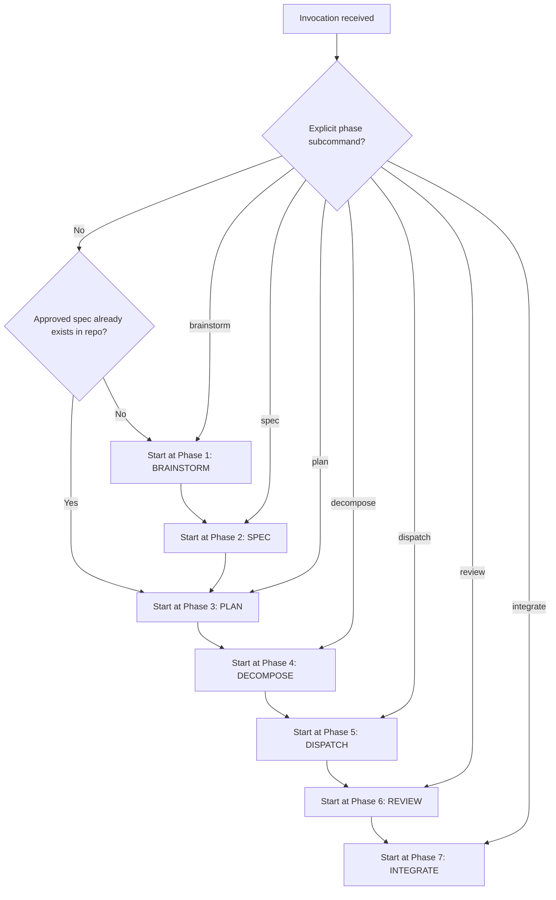

## Phase 1: Brainstorm

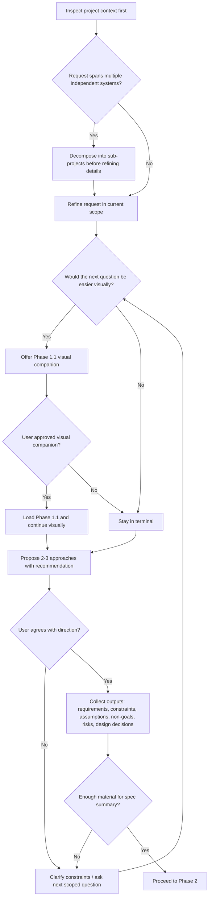

## Phase 1.1: Visual Companion

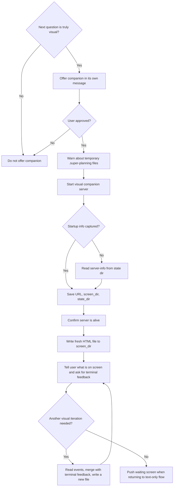

## Phase 2: Spec

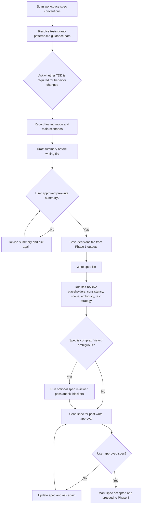

## Phase 3: Plan

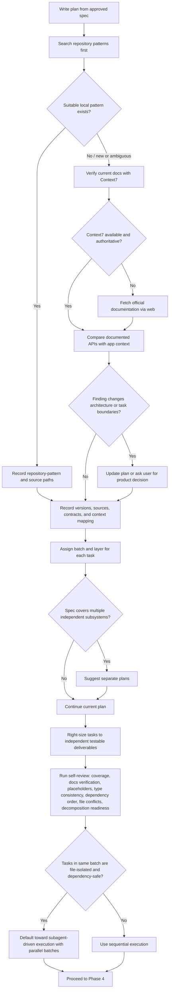

## Phase 4: Decompose

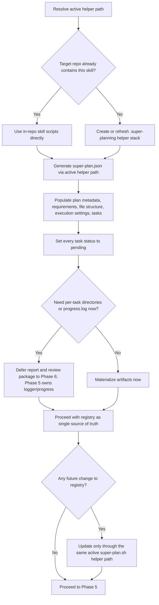

## Phase 5: Dispatch

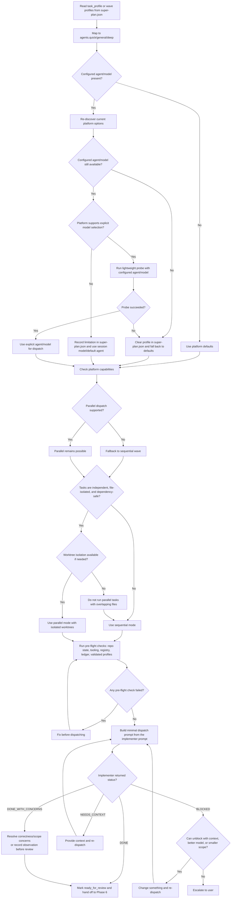

## Phase 6: Review

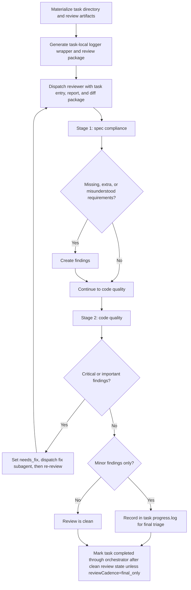

## Phase 7: Integrate

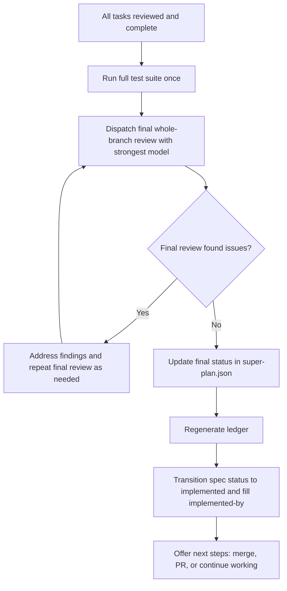

## Cross-Phase Error Recovery

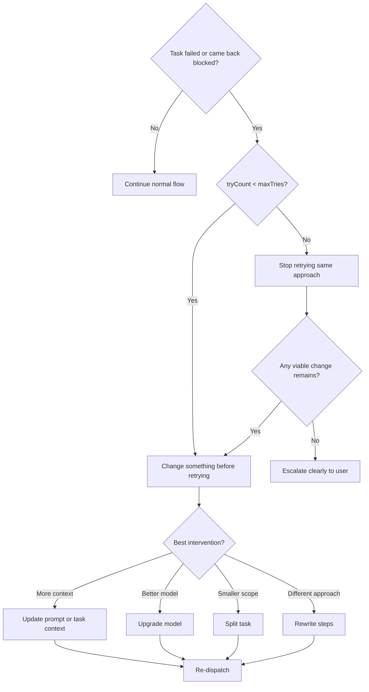

## Status Lifecycle

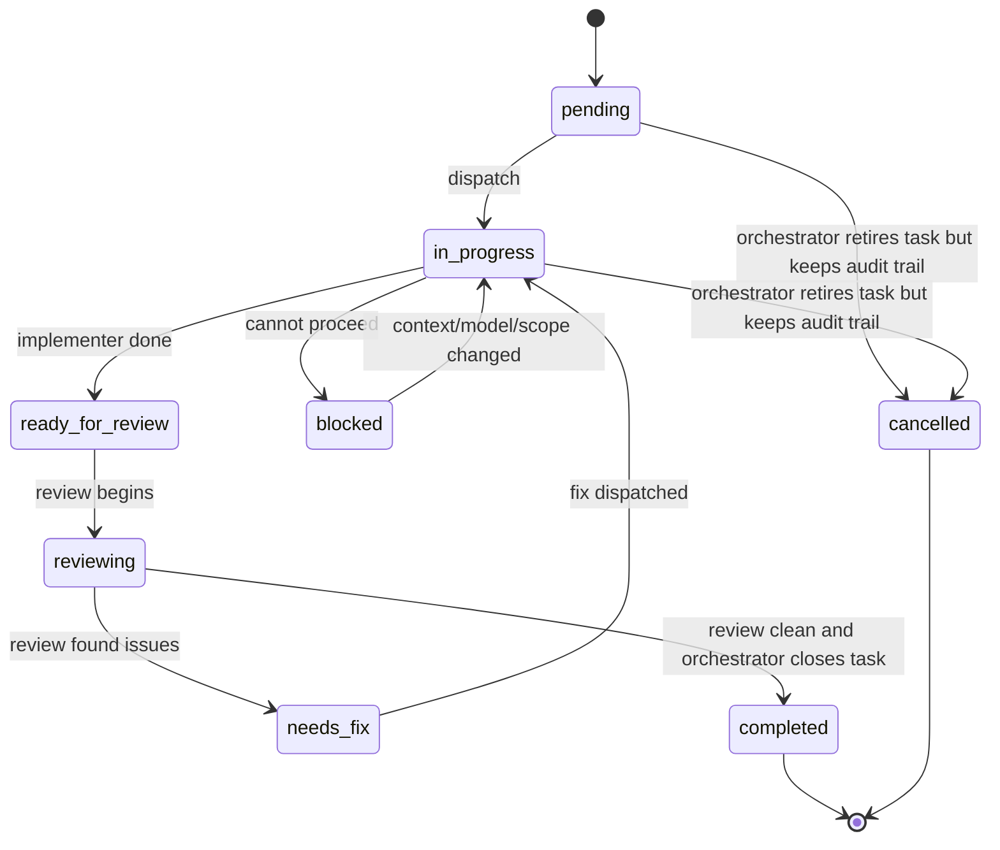
