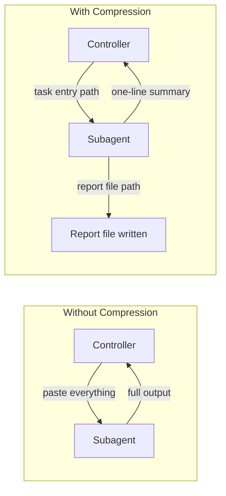

# Subagent Guide

Model selection, context compression, and handoff strategies for subagents.

## Model Selection

See the model and strategy selection table in [`phases/05-dispatch.md`](../phases/05-dispatch.md).

## Task Profiles

Each new task in `super-plan.json` must have a `task_profile` that resolves to a fixed executor role in `agents`:

- `general`: normal implementation and debugging tasks → `agents.generalExecutor` + `agents/general-executor.md`
- `deep`: hard, ambiguous, multi-file, or high-judgment tasks → `agents.deepExecutor` + `agents/deep-executor.md`

The registry also records `taskReviewer`, `investigator`, `specReviewer`, and `finalAuditor`. Each role maps to a fixed prompt in `agents/` and carries optional `model`, `agent`, and `effort` overrides. When empty, the orchestrator uses the platform default.

Before dispatching a subagent, the orchestrator must verify that the resolved role profile's `agent/model/effort` is still available on the current platform. If not, it should clear the fields in `super-plan.json` and fall back to the system default. Legacy registries with `quick` remain readable, but new plans do not create it.

## Context Compression

Compressed output formats by role (implementer, reviewer, investigator) are documented in [`SKILL.md`](../SKILL.md).

### Principle: File-Based Handoff

**Key principle:** Everything subagents produce goes into a file, not back into your context.
