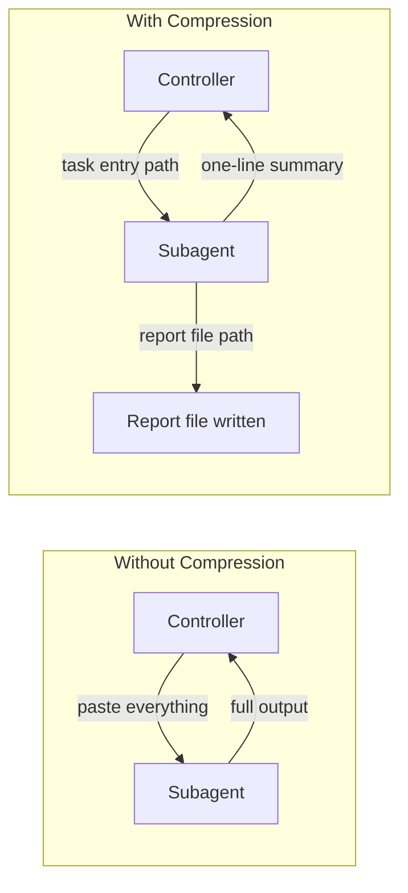

# Subagent Guide

Model selection, context compression, and handoff strategies for subagents.

## Model Selection

See the model and strategy selection table in [`phases/05-dispatch.md`](../phases/05-dispatch.md).

## Task Profiles

Each task in `super-plan.json` must have a `task_profile` and each profile must point to a configuration in `agents`:

- `quick`: fast, mechanical, well-scoped tasks
- `general`: normal implementation and debugging tasks
- `deep`: hard, ambiguous, multi-file, or high-judgment tasks

When `agents.<profile>.model` and `agents.<profile>.agent` are populated, the orchestrator should try to use that configuration. When empty, it should use the platform default.

Before dispatching a subagent, the orchestrator must verify that the configured `agent/model` is still available on the current platform. If not, it should clear the fields in `super-plan.json` and fall back to the system default.

## Context Compression

Compressed output formats by role (implementer, reviewer, investigator) are documented in [`SKILL.md`](../SKILL.md).

### Principle: File-Based Handoff

**Key principle:** Everything subagents produce goes into a file, not back into your context.
