# Workflows

> Process: super-planning — this is the operational map. The authoritative
> rules remain in [`super-planning/SKILL.md`](../SKILL.md) and the linked files
> under [`super-planning/phases/`](../phases/).

These diagrams include the actions, gates, artifacts, decisions, recovery
paths, and handoffs required by the current skill. Labels point to the source
file when a rule is too detailed to duplicate safely in a diagram.

Path convention: `super-planning/...` means this skill directory;
`<repo>/...` means the target project; `.super-planning/...` means the helper
copy created inside `<repo>` when the skill is not vendored there.

## Complete End-to-End Flow

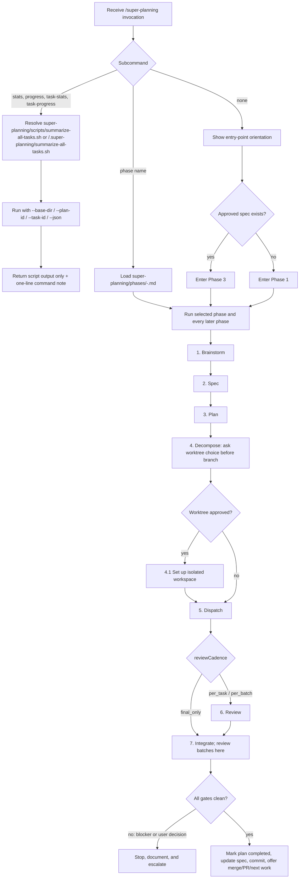

## Cross-Phase Invariants

```mermaid
flowchart LR
    A["super-planning/SKILL.md router"] --> B["super-planning/phases/<NN>-<phase>.md is authoritative"]
    B --> C["Artifacts are file-based handoffs"]
    C --> D["<repo>/docs/jobs/<NNNN>-<feature>/super-plan.json is registry source of truth"]
    D --> E["Mutate registry only via super-planning/scripts/super-plan.sh or <repo>/.super-planning/super-plan.sh"]
    E --> F["Regenerate <repo>/docs/jobs/<NNNN>-<feature>/progress-ledger.md"]
    F --> G["Never edit registry by hand"]
    G --> H["Never dispatch completed task"]
    H --> I["Ask worktree choice before defining implementation branch"]
    I --> J["Never start implementation on main/master without consent"]
```

## Phase 1: Brainstorm — Complete Flow

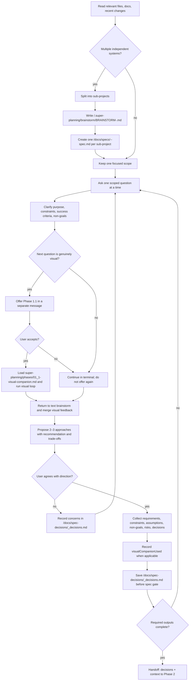

## Phase 1.1: Visual Companion — Complete Flow

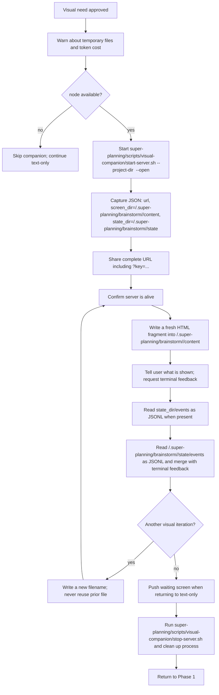

## Phase 2: Spec — Complete Flow

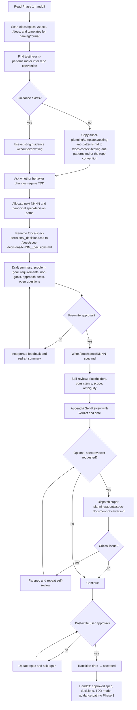

## Phase 3: Plan — Complete Flow

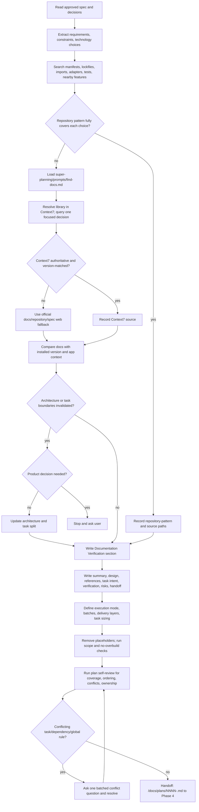

## Phase 4: Decompose — Complete Flow

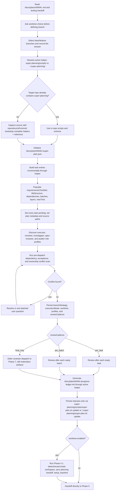

## Phase 5: Dispatch — Complete Flow

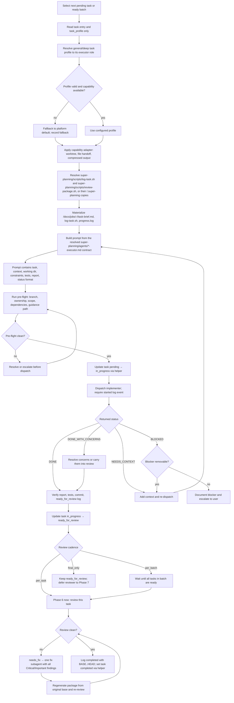

## Phase 6: Review — Complete Flow

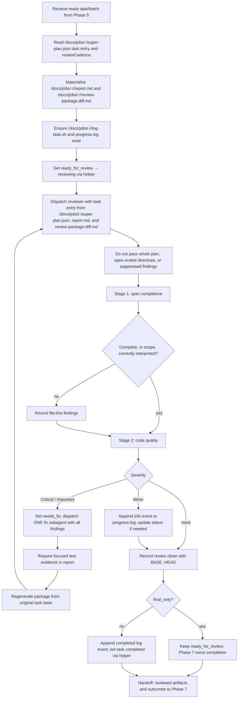

## Phase 7: Integrate — Complete Flow

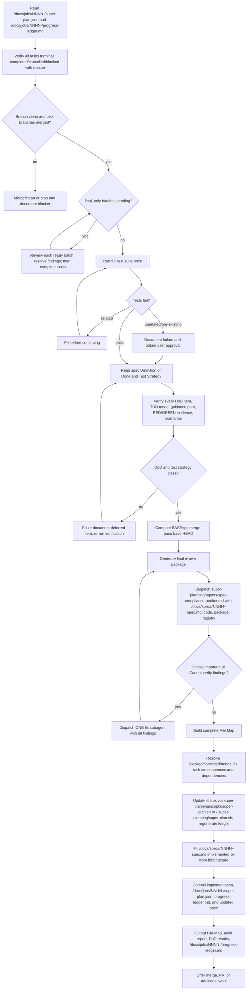

## Phase 8: Reference, Recovery, and Modification — Complete Flow

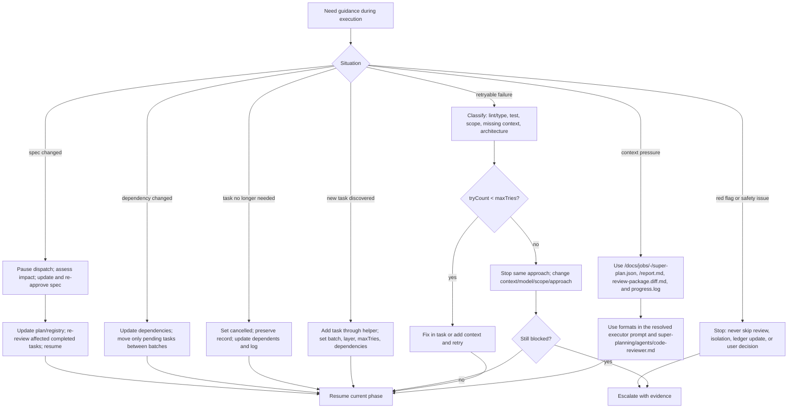
