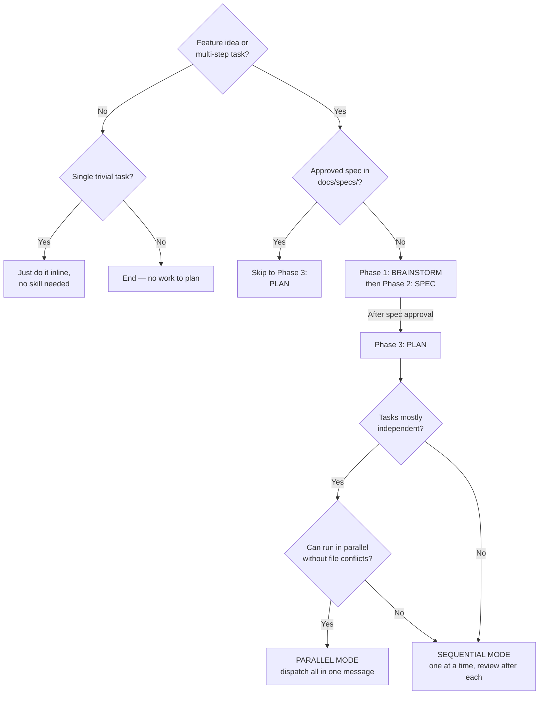
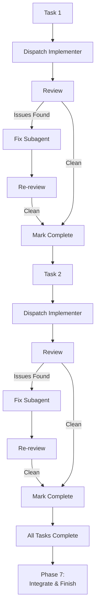
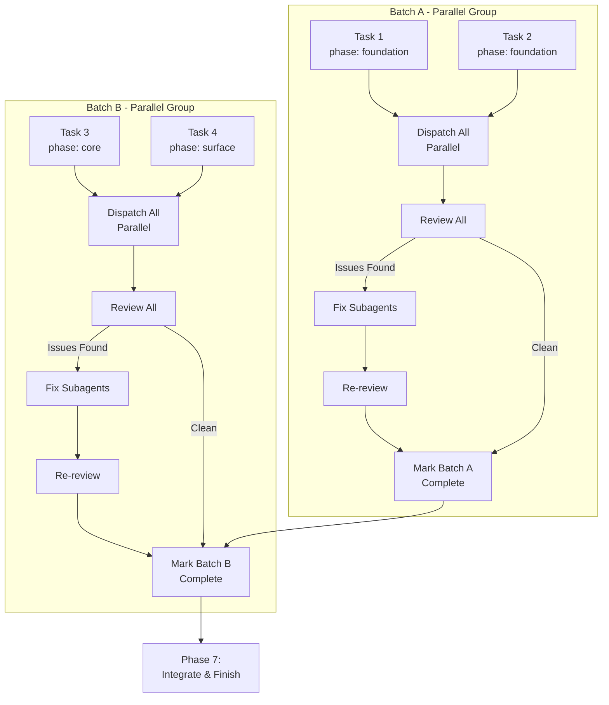
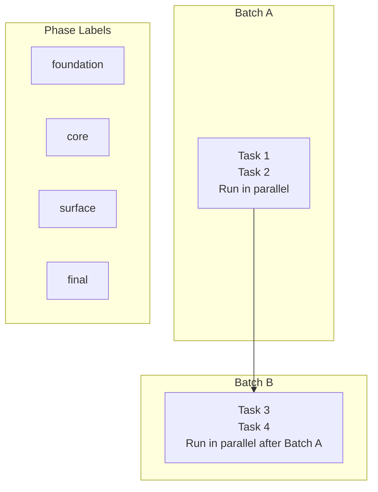
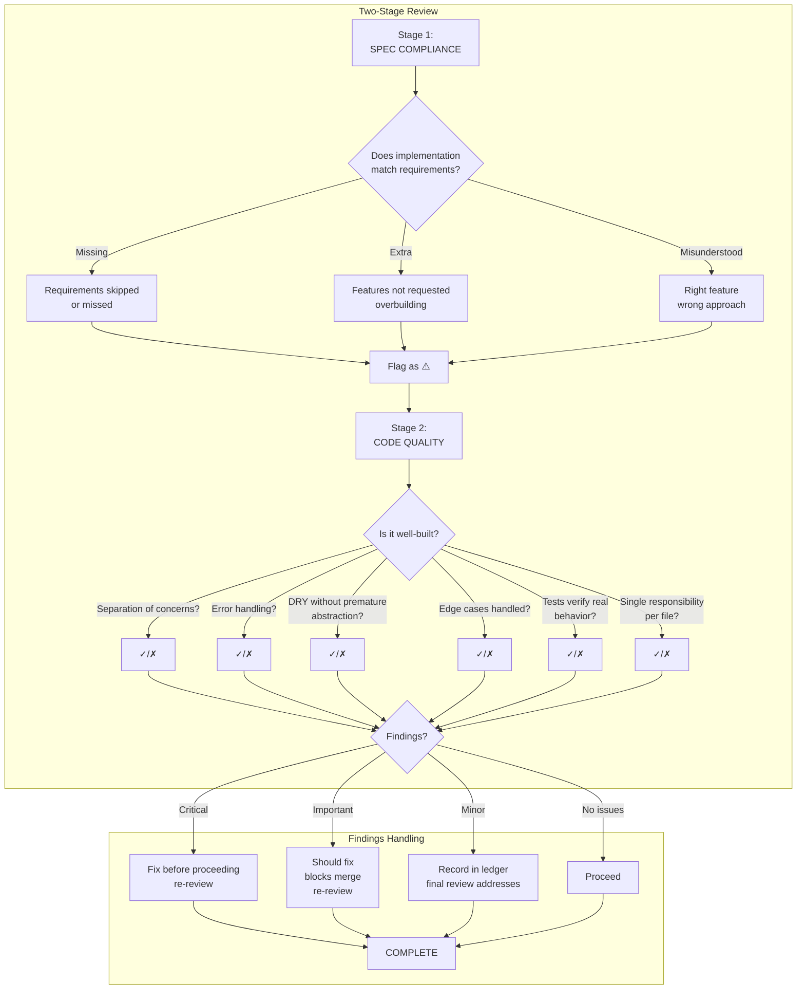
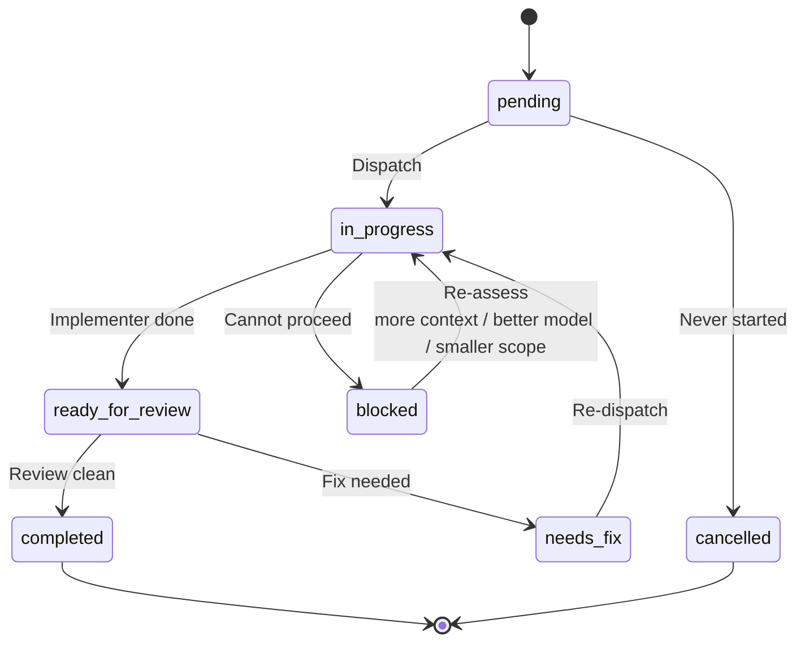
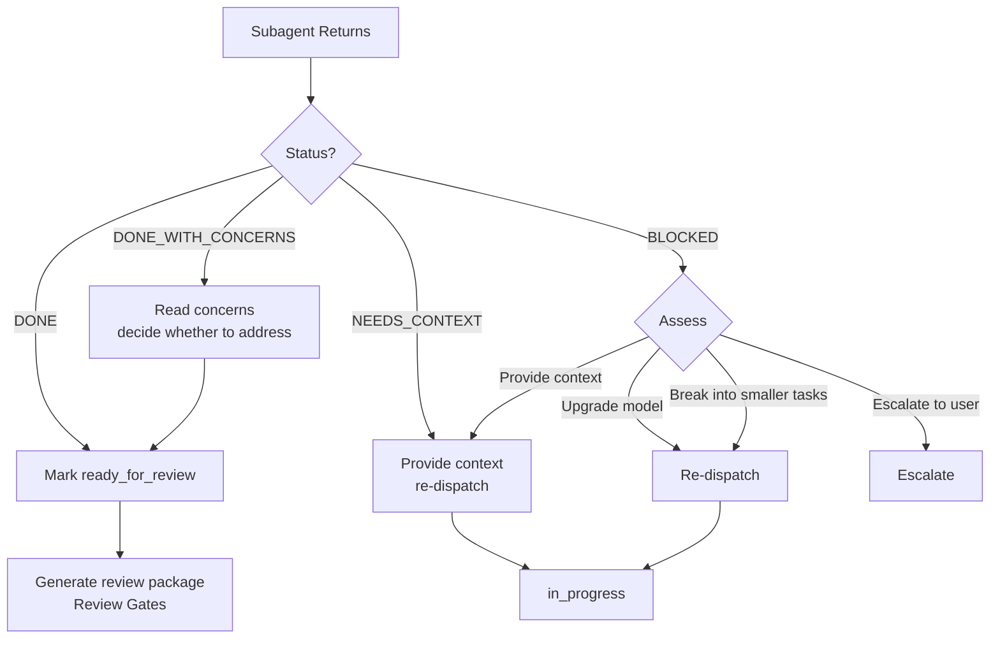
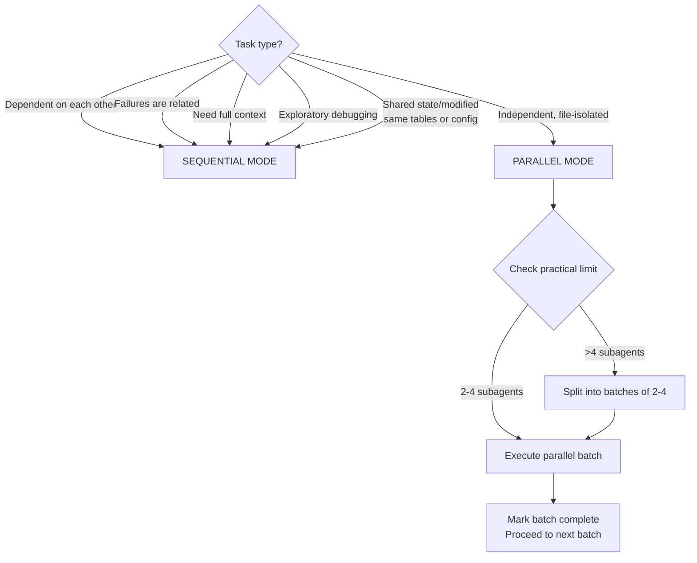
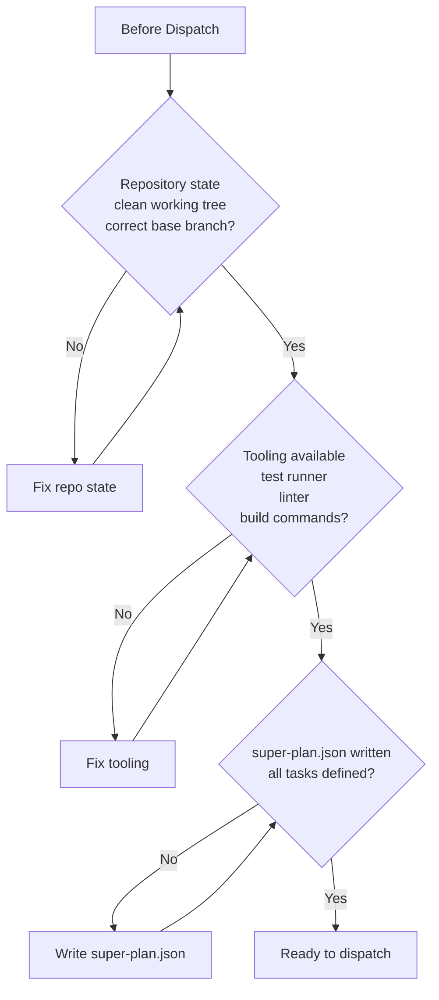
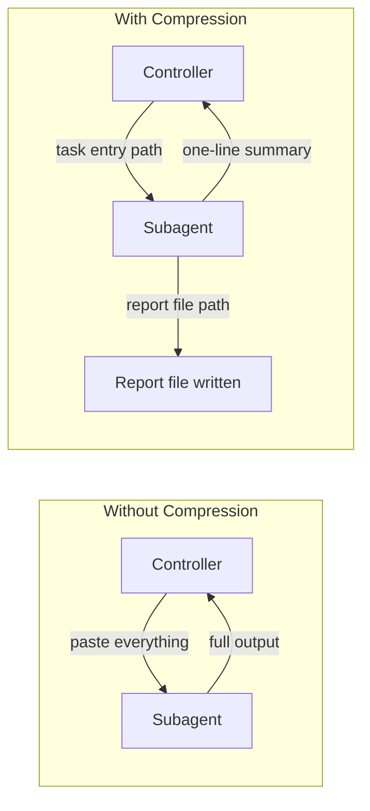

# super-planning

Create implementation plans decomposed into tasks and execute them via subagents — sequential or parallel — to reduce context pressure on the main agent.

> **Agent note:** Start at [`SKILL.md`](SKILL.md) for the routing entrypoint. The skill now supports a default full workflow plus phase-entry subcommands like `/super-planning brainstorm`, `/super-planning spec`, and `/super-planning plan`. The full decision trees below are the visual companion to that file; detailed phase instructions live in [`phases/`](phases/).

Phase 1 now includes the full brainstorming workflow and can optionally use the embedded visual companion documented in [`phases/01_1-visual-companion.md`](phases/01_1-visual-companion.md).

## Modes

| Invocation | What happens |
| ---------- | ------------ |
| `/super-planning` | Runs the standard end-to-end workflow. |
| `/super-planning brainstorm` | Starts at Phase 1 and continues forward. |
| `/super-planning spec` | Starts at Phase 2 and continues forward. |
| `/super-planning plan` | Starts at Phase 3 and continues forward. |
| `/super-planning decompose` | Starts at Phase 4 and continues forward. |
| `/super-planning dispatch` | Starts at Phase 5 and continues forward. |
| `/super-planning review` | Starts at Phase 6 and continues forward. |
| `/super-planning integrate` | Starts at Phase 7. |

## Operation Flows

### Decision Flow: When to Use



### 7-Phase Workflow


### Sequential Dispatch Flow



### Parallel Dispatch Flow



### Batch-Based Execution



### Review Gates Flow



### Task Lifecycle



### Subagent Status Handling



### File Handoff Structure

```mermaid
flowchart TB
    subgraph docs/
        subgraph specs/
            SPEC[NNNN-<feature-name>-spec.md<br/>Spec - contract with user]
        end
        subgraph plans/
            PLAN[NNNN-<feature-name>.md<br/>Plan - linked to spec by number]
        end
        subgraph tasks/NNNN-<feature-name>/
            TASKS[super-plan.json<br/>Generated by scripts/super-plan.sh<br/>Single source of truth]
            LEDGER[progress-ledger.md<br/>Plan progress tracker]
            subgraph Task-A-0001/
                REPORT1[report.md<br/>Subagent output]
                REVIEW1[review-package.diff.md<br/>Reviewer input]
                LOG1[progress.log<br/>Task progress]
                HELPER1[log-task.sh<br/>Task-local logger]
            end
        end
    end
    SPEC --> PLAN
    PLAN --> TASKS
```

### When to Use Sequential vs Parallel



### Pre-Flight Checks



## Quick Reference

| Phase               | Key Output                                  | Gate                                   |
| ------------------- | ------------------------------------------- | -------------------------------------- |
| Phase 1: Brainstorm | Requirements, constraints, design decisions, optional `docs/specs/{feature_number}_{feature_name}_decisions.md` | HARD: complete the integrated brainstorm flow |
| Phase 2: Spec       | `docs/specs/NNNN-<name>-spec.md`            | User approval (pre-write + post-write) |
| Phase 3: Plan       | `docs/plans/NNNN-<name>.md`                 | Self-review checklist                  |
| Phase 4: Decompose  | `docs/tasks/NNNN-<name>/super-plan.json`    | Create with `scripts/super-plan.sh`, then fill tasks |
| Phase 5: Dispatch   | Subagent work                               | Pre-flight checks; do not create task dirs or ledger |
| Phase 6: Review     | Two-stage review + task artifact materialization | Critical/Important must be fixed       |
| Phase 7: Integrate  | Final review, merge prep                    | Full test suite passes                 |

## Red Flags

See the full list in `SKILL.md` → **Red Flags** section. Key rules:

- Never skip review or accept "close enough" on spec compliance
- Never dispatch parallel subagents without file isolation or a platform fallback
- Never start implementation on main/master without explicit consent
- Never re-dispatch a task the progress log or ledger marks complete

## Subagent Model Selection

See the model selection table and strategy in SKILL.md Phase 5.

## Context Compression

See SKILL.md for compressed output formats per role (implementer, reviewer, investigator).



Key principle: **File-based handoffs** — everything subagents produce goes to a file, not back into your context.
