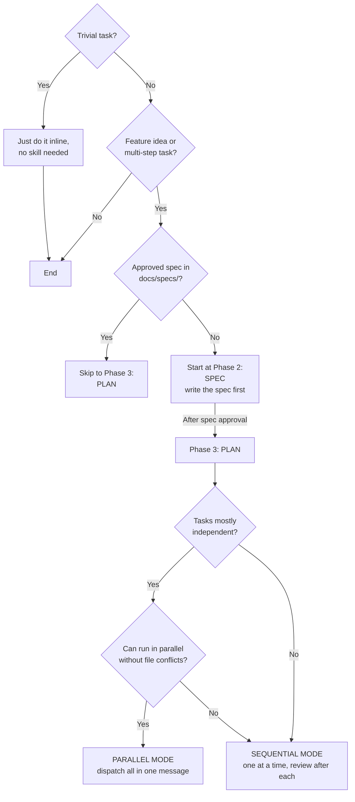
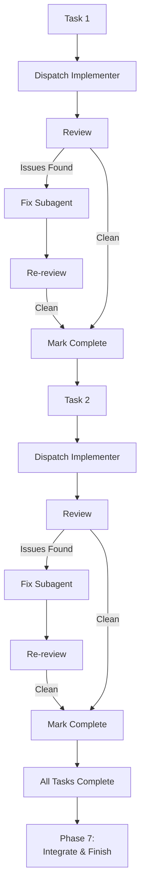
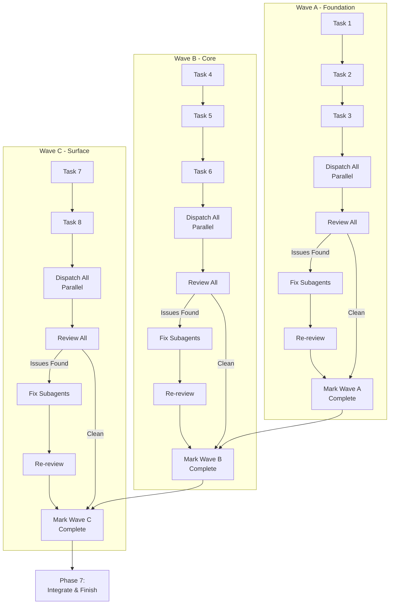
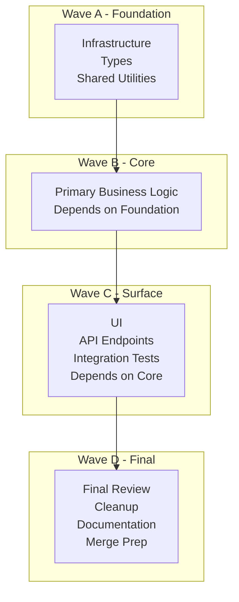
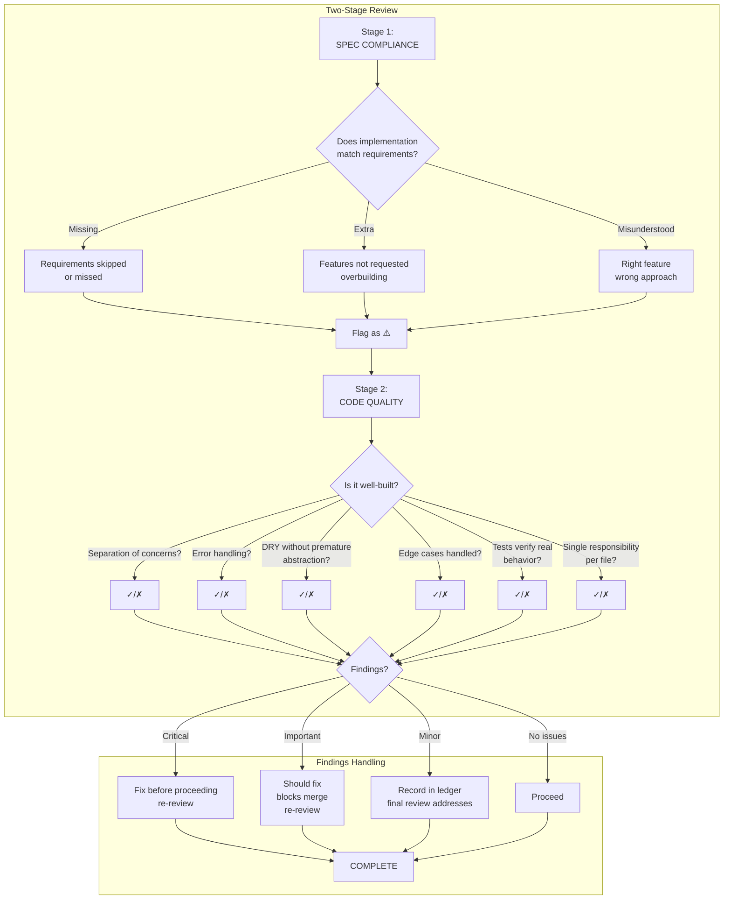
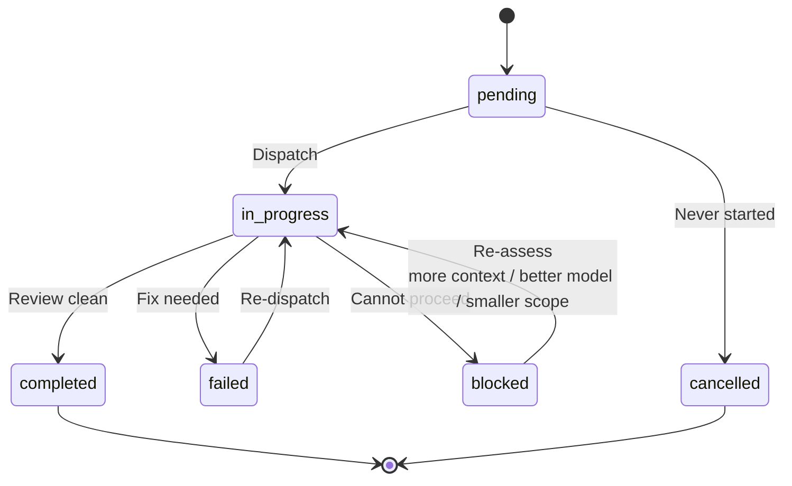
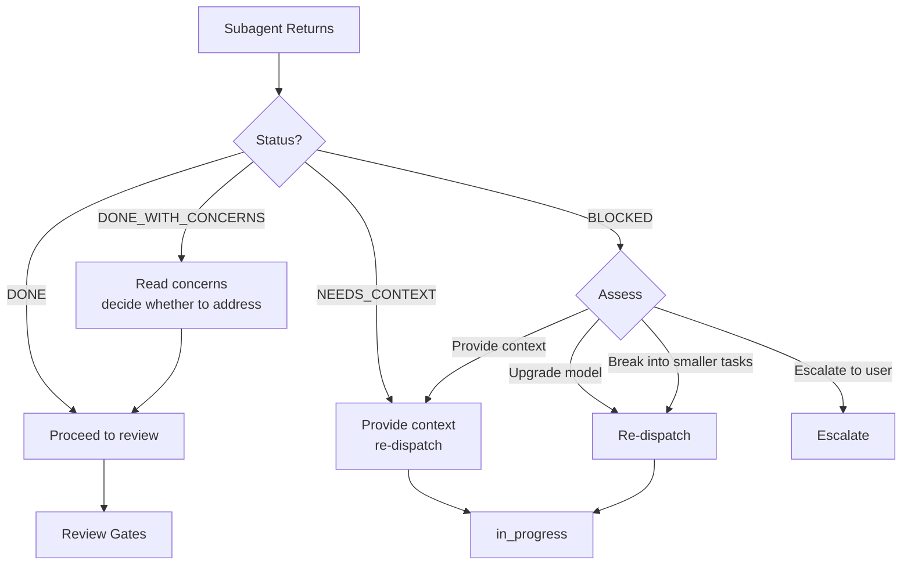
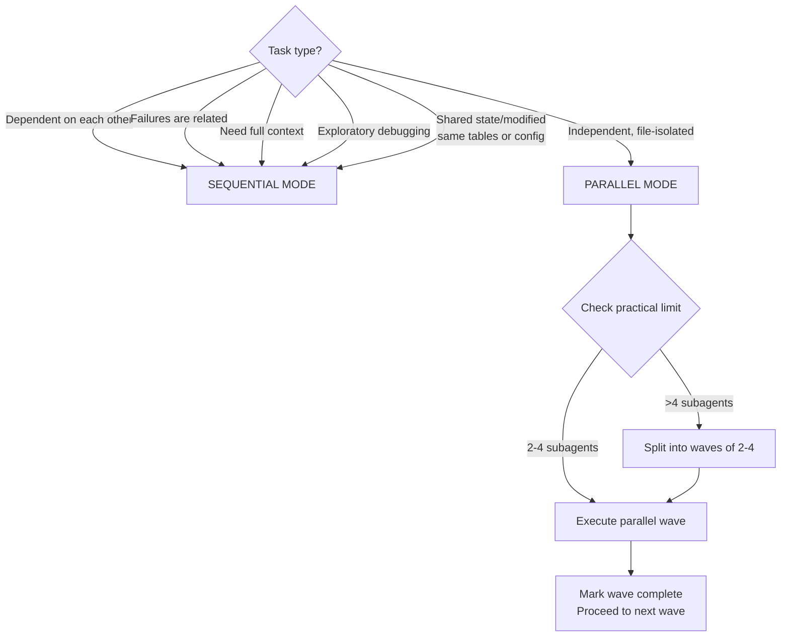
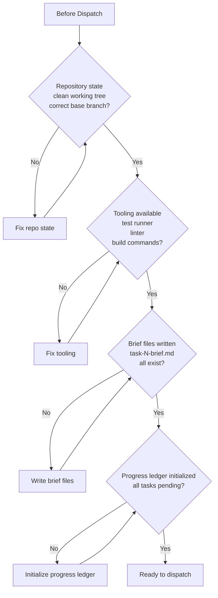
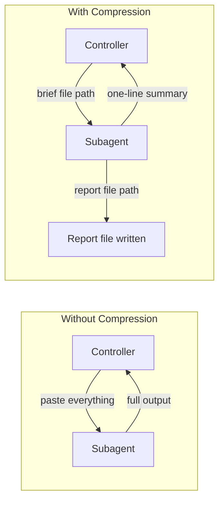

# super-planning

Create implementation plans decomposed into tasks and execute them via subagents — sequential or parallel — to reduce context pressure on the main agent.

## Operation Flows

### Decision Flow: When to Use



### 7-Phase Workflow


### Sequential Dispatch Flow



### Parallel Dispatch Flow



### Wave-Based Execution



### Review Gates Flow



### Task Lifecycle



### Subagent Status Handling



### File Handoff Structure

```mermaid
flowchart TB
    subgraph docs/
        subgraph specs/
            SPEC[NNNN-<feature-name>-spec.md<br/>Spec - contract with user]
        end
        subgraph plans/
            PLAN[NNNN-<feature-name>.md<br/>Plan - linked to spec by number]
        end
        subgraph tasks/NNNN-<feature-name>/
            BRIEF1[task-1-brief.md<br/>Subagent requirements]
            REPORT1[task-1-report.md<br/>Subagent output]
            BRIEF2[task-2-brief.md]
            REPORT2[task-2-report.md]
            PROGRESS[progress.md<br/>Shared progress tracker]
            TASKS[tasks.json<br/>Machine-readable registry]
        end
    end
    SPEC --> PLAN
    PLAN --> BRIEF1
    PLAN --> BRIEF2
```

### When to Use Sequential vs Parallel



### Pre-Flight Checks



## Quick Reference

| Phase               | Key Output                                             | Gate                                   |
| ------------------- | ------------------------------------------------------ | -------------------------------------- |
| Phase 1: Brainstorm | Requirements, constraints, design decisions            | HARD: must invoke brainstorming skill  |
| Phase 2: Spec       | `docs/specs/NNNN-<name>-spec.md`                       | User approval (pre-write + post-write) |
| Phase 3: Plan       | `docs/plans/NNNN-<name>.md`                            | Self-review checklist                  |
| Phase 4: Decompose  | `docs/tasks/NNNN-<name>/task-N-brief.md`, `tasks.json` | Tasks linked to plan number            |
| Phase 5: Dispatch   | Subagent work                                          | Pre-flight checks                      |
| Phase 6: Review     | Two-stage review                                       | Critical/Important must be fixed       |
| Phase 7: Integrate  | Final review, merge prep                               | Full test suite passes                 |

## Red Flags (Never Do)

- ❌ Skip task review or accept a report missing verdict
- ❌ Proceed with unfixed Critical/Important issues
- ❌ Dispatch multiple implementers in parallel without file isolation
- ❌ Make a subagent read the whole plan (hand it its brief instead)
- ❌ Skip scene-setting context
- ❌ Ignore subagent questions
- ❌ Accept "close enough" on spec compliance
- ❌ Dispatch a reviewer without a diff file
- ❌ Move to next task while review has open Critical/Important issues
- ❌ Re-dispatch a task the progress ledger marks complete
- ❌ Start implementation on main/master without explicit user consent
- ❌ Tell a reviewer what not to flag

## Subagent Model Selection

| Role                                                               | Model                                                | Why                                                           |
| ------------------------------------------------------------------ | ---------------------------------------------------- | ------------------------------------------------------------- |
| Mechanical implementation (isolated, clear spec, 1-2 files)        | Cheap/fast                                           | Most implementation is mechanical when plan is well-specified |
| Integration and judgment (multi-file, pattern matching, debugging) | Standard                                             | Needs context awareness across files                          |
| Architecture and design                                            | Most capable                                         | Requires broad reasoning                                      |
| Task review                                                        | Standard for small diffs, capable for subtle changes | Review is judgment work                                       |
| Final whole-branch review                                          | Most capable                                         | High-stakes, broad scope                                      |

## Context Compression



Key principle: **File-based handoffs** — everything subagents produce goes to a file, not back into your context.
