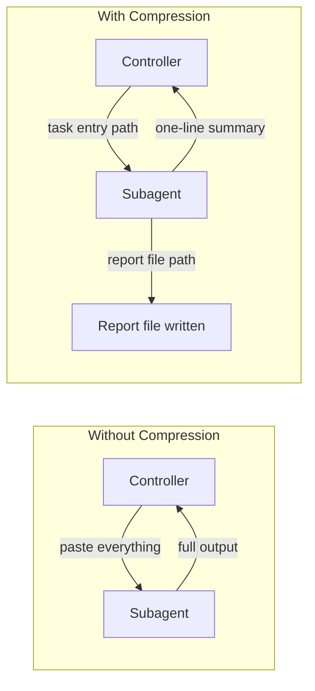

# Guia de Subagentes

Seleção de modelo, compressão de contexto e estratégias de handoff para subagentes.

## Seleção de Modelo

Consulte a tabela de seleção de modelo e estratégia em [`SKILL.md`](../SKILL.md) Fase 5.

## Compressão de Contexto

Formatos de saída comprimida por papel (implementer, reviewer, investigator) estão documentados em [`SKILL.md`](../SKILL.md).

### Princípio: Handoff Baseado em Arquivos

**Princípio chave:** Tudo que os subagentes produzem vai para um arquivo, não de volta para o seu contexto.
