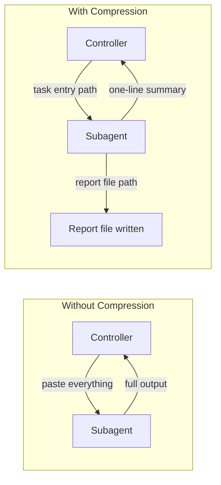

# Guia de Subagentes

Seleção de modelo, compressão de contexto e estratégias de handoff para subagentes.

## Seleção de Modelo

Consulte a tabela de seleção de modelo e estratégia em [`SKILL.md`](../SKILL.md) Fase 5.

## Perfis de Task

Cada task no `super-plan.json` deve ter `task_profile` e cada perfil deve apontar para uma configuração em `agents`:

- `quick`: tarefas rápidas, mecânicas e bem delimitadas
- `general`: tarefas normais de implementação e debugging
- `deep`: tarefas difíceis, ambíguas, multi-arquivo ou de maior julgamento

Quando `agents.<perfil>.model` e `agents.<perfil>.agent` estiverem preenchidos, o orquestrador deve tentar usar essa configuração. Quando estiverem vazios, deve usar o default da plataforma.

Antes de disparar um subagente, o orquestrador deve verificar se o `agent/model` configurado ainda está disponível na plataforma atual. Se não estiver, deve limpar os campos no `super-plan.json` e cair para o default do sistema.

## Compressão de Contexto

Formatos de saída comprimida por papel (implementer, reviewer, investigator) estão documentados em [`SKILL.md`](../SKILL.md).

### Princípio: Handoff Baseado em Arquivos

**Princípio chave:** Tudo que os subagentes produzem vai para um arquivo, não de volta para o seu contexto.
