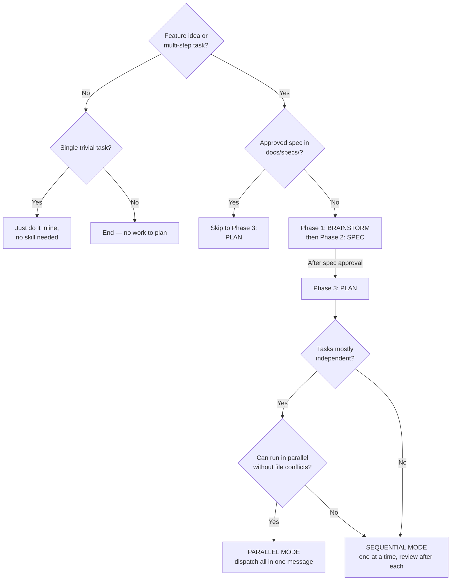
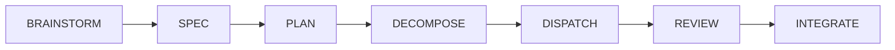
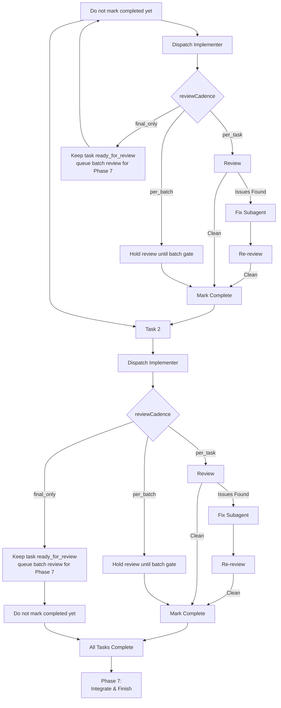
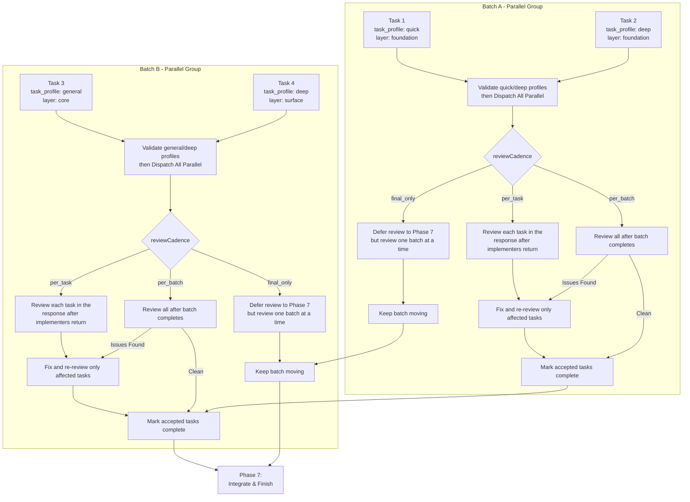
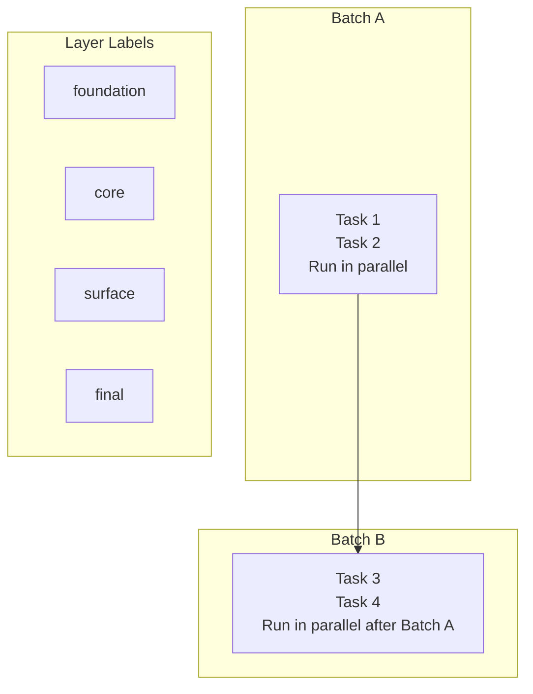
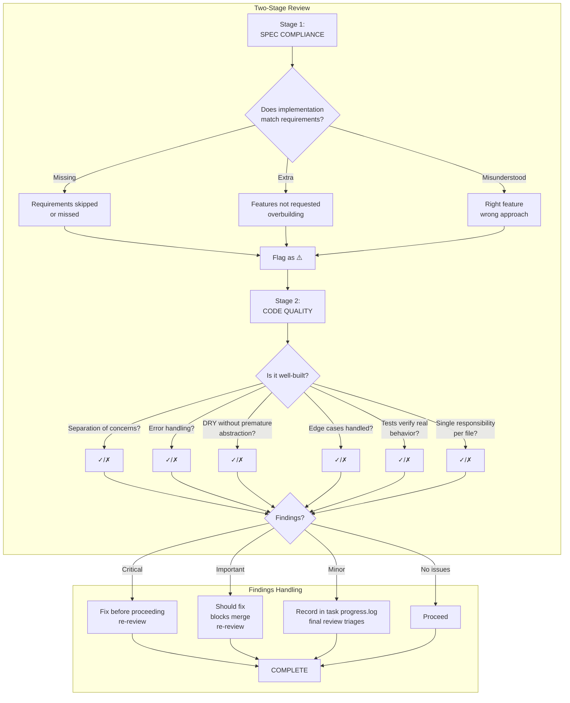
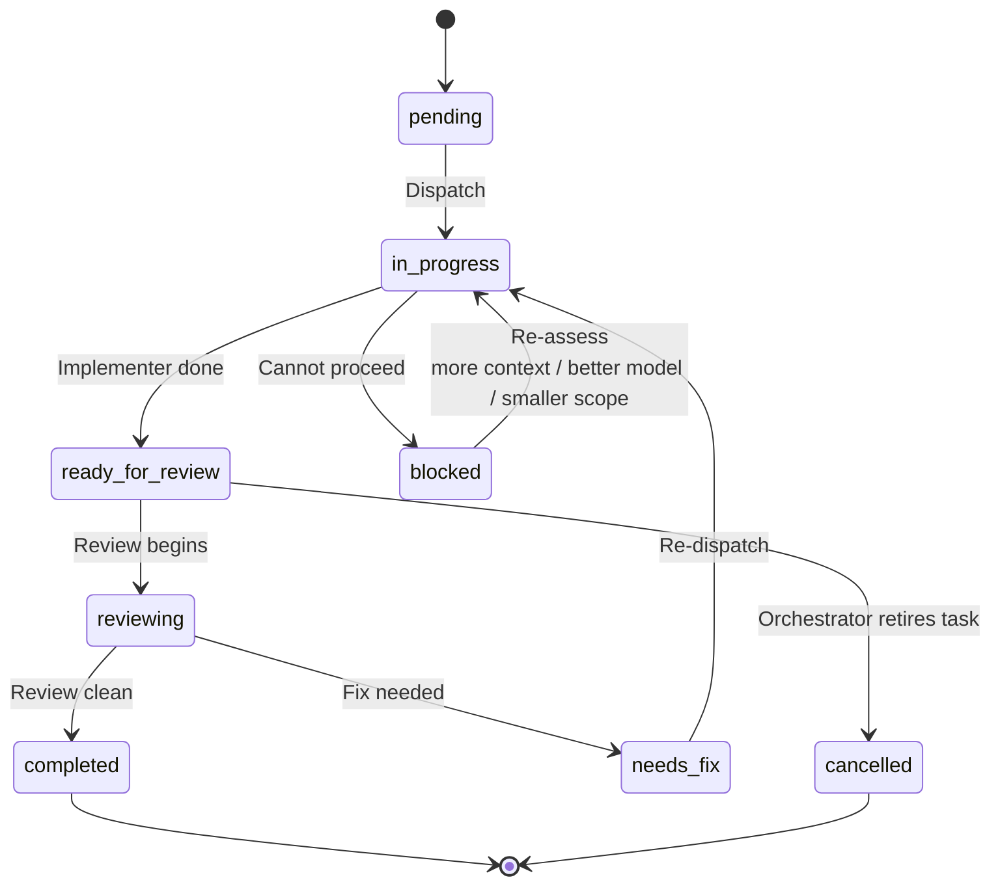
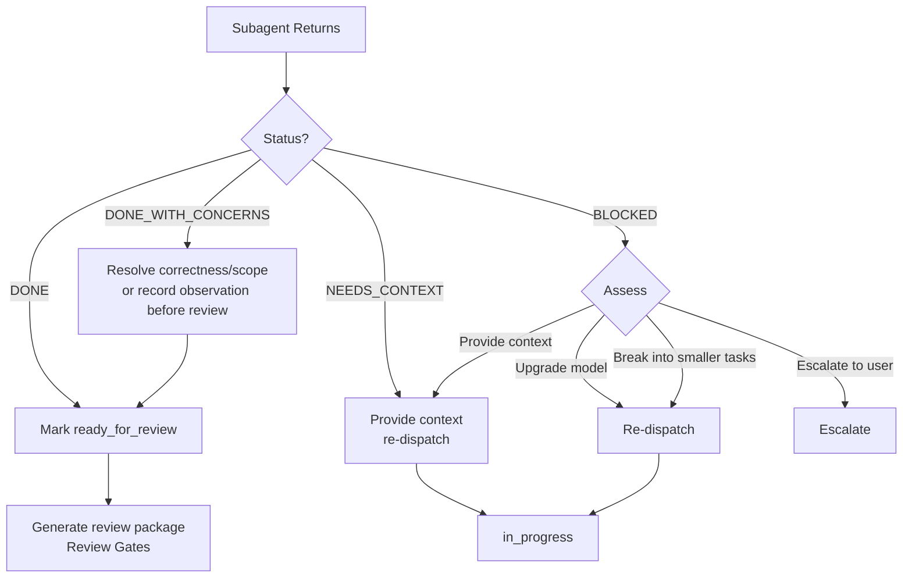
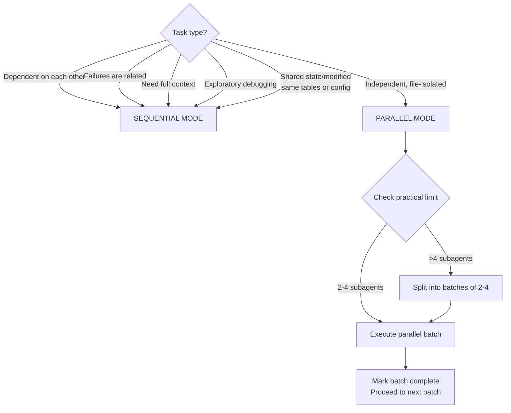
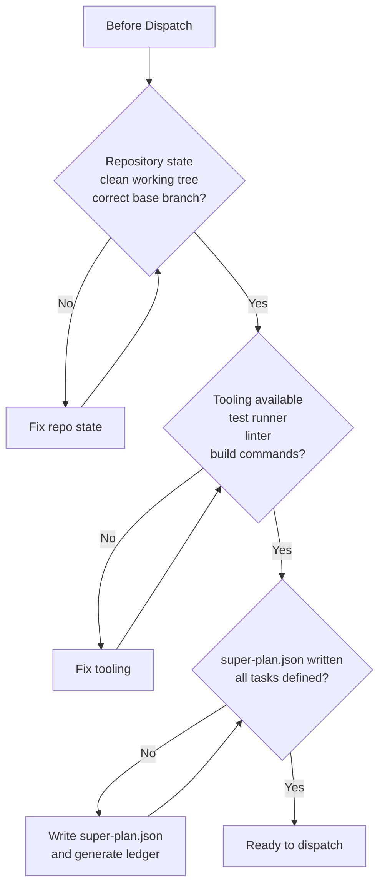

# Workflows

Detailed diagrams of super-planning decision, execution, and review flows.

## Decision Flow: When to Use

## 7-Phase Flow

## Sequential Dispatch Flow

## Parallel Dispatch Flow

## Batch-Based Execution

## Review Gates Flow

## Task Lifecycle

## Subagent Status Handling

## Sequential vs Parallel: When to Use

## Pre-Flight Checks

